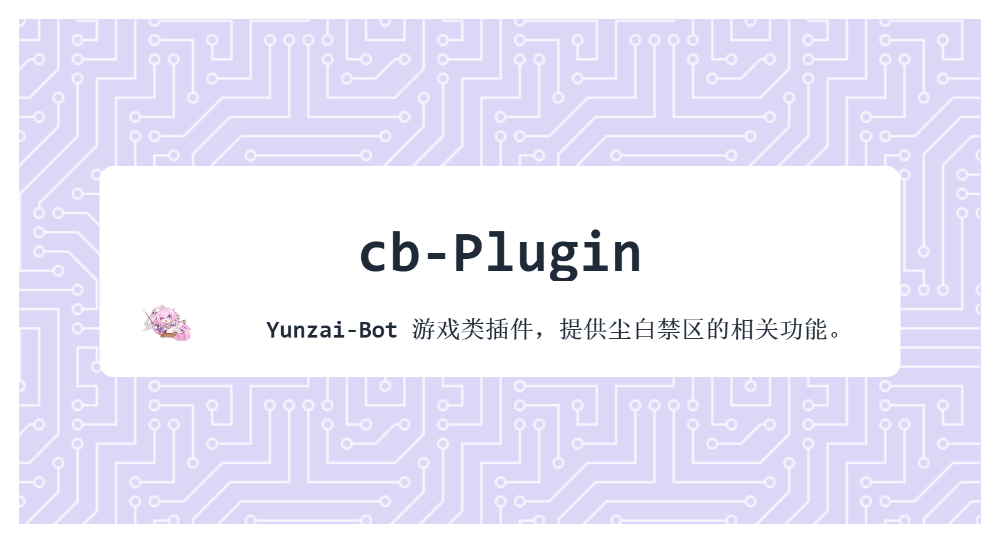

# cb-plugin
**_cb-Plugin是一个Yunzai-Bot的游戏类插件，提供尘白禁区的相关功能。_**



## 安装教程 💡
### 自动安装（推荐）
1. 在Yunzai目录打开终端，运行
    ```sh
    git clone https://github.com/Sakura1618/cb-plugin.git ./plugins/cb-plugin
    ```
2. 重启 Yunzai-Bot 后即可使用。

### 手动安装
1. 下载 [cb-plugin](https://github.com/Sakura1618/cb-plugin) 的代码。
2. 将 cb-plugin 放置在 Yunzai-Bot 的 plugins 目录下。
3. 重启 Yunzai-Bot 后即可使用。

## 功能介绍 📖

- 帮助图：cb帮助
- 查看养成材料：cb材料
- 查看强度榜：cb强度榜
- 当前版本数据金：cb数据金
- 查看所有装甲：cb角色列表
- 角色攻略指令：cb<装甲名>攻略  
例：cb龙舌兰攻略

## 免责声明 ❗

1. 功能仅限内部交流与小范围使用，请勿将Yunzai-Bot及cb-plugin用于任何以盈利为目的的场景.
2. 图片与其他素材均来自于网络，仅供交流学习使用，如有侵权请联系，会立即删除.

## 特别鸣谢 ❤️
攻略图来源：[次元啾啾](https://space.bilibili.com/457766125) 、[小伟籽](https://space.bilibili.com/297410355)  
本项目的贡献者：[圈圈 WalkerTian](https://github.com/Walkersifolia)  